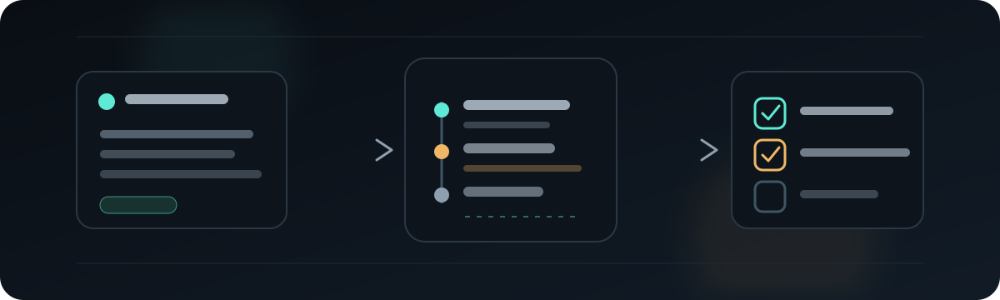
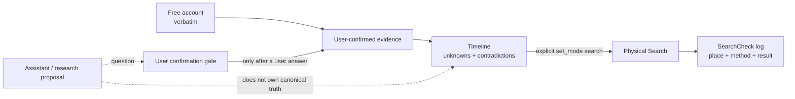
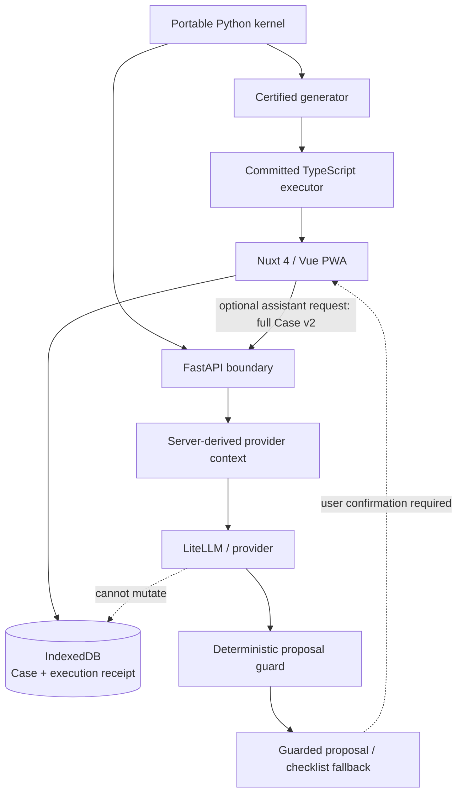

# MIND Detective

<!-- release-0.4.0 -->

<p align="center">
  
</p>

<p align="center">
  <strong>Systematic lost-item search without guessing or pseudo-probabilities.</strong><br />
  MIND Detective reduces working-memory load by separating what the user actually said and confirmed from questions and hypotheses, then guiding a reproducible physical-search process.
</p>

<p align="center">
  <a href="README.md">Русский</a> · <a href="README.en.md"><strong>English</strong></a>
</p>

<p align="center">
  <a href="https://github.com/trafficolog/mind-detective/releases/tag/0.4.0"></a>
  <a href="https://github.com/trafficolog/mind-detective/actions/workflows/ci.yml"></a>
  
  
  <a href="LICENSE"></a>
</p>

> **0.4.0 is published.** It is the Web Reconstruction Foundation: deterministic Reconstruction is available locally in the Web/PWA and does not require a live model for canonical memory evidence. The `0.4.1` research line is separate and **has not been released**.

## What it is and who it is for

MIND Detective is a systematic lost-item search assistant. It is useful when the problem is not “invent one more place to look,” but keeping the search coherent: what you actually remember, where the gaps are, what has already been checked, and how it was checked.

Instead of a chatbot-first surface, the product maintains **case state**. Conversation history is not canonical truth by itself. Canonical state is built from the user’s account, user-confirmed evidence, the timeline, and the physical SearchCheck log.

| MIND does | MIND does not |
| --- | --- |
| Preserves the free account verbatim | Does not “restore memory” for the user |
| Separates confirmed evidence from questions/hypotheses | Does not promote plausible guesses into recollection |
| Preserves unknown intervals and contradictions | Does not fill gaps with invented chronology |
| Logs actual physical checks | Does not claim the item’s real location |
| Keeps the case resumable | Does not assign calibrated probabilities to locations |

## How one case works

The basic path is:

```text
free account
→ user-confirmed evidence
→ timeline with unknown intervals and contradictions
→ explicit transition to Search
→ physical checks
→ SearchCheck log with check method
→ pause / resume / export / close
```

Example: you cannot find your keys and only remember “I left the office, got into the car, and drove home.” MIND preserves that account verbatim, lets you confirm the actions and places you actually know, leaves genuinely unknown parts unknown, and then moves the case into Search. “I visually checked the backpack” is recorded specifically as a visual check; if you later inspect the pockets by hand, that is a different SearchCheck rather than a rewrite of the earlier record.

### Reconstruction ≠ Search

**Reconstruction** asks: *what is supported about the event sequence, and what remains unknown or contradictory?*

**Search** asks: *what physical action should be checked next, and what has actually been checked already?*

The separation is deliberate. An assistant question or research proposal does not become canonical evidence. It can only lead to a new user answer, which then crosses the normal user-confirmation boundary.



## Core capabilities

- **State-first Web/PWA** — the main surface shows search state instead of requiring users to reconstruct context from chat history.
- **Local-first Case persistence** — Web canonical state lives in IndexedDB; a new Case is stored locally immediately.
- **Verbatim free account** — the raw account is preserved as `free_account` and is not automatically classified as recollection/habit/observation.
- **User-confirmed evidence** — structured evidence exists only after explicit user confirmation.
- **Uncertainty-preserving timeline** — unknown intervals and contradictions remain explicit instead of being “resolved” by a model.
- **Systematic physical search** — Search is distinct from Reconstruction and focuses on checkable physical actions.
- **Method-aware SearchCheck log** — the journal records not just “checked” but how the check was performed.
- **Offline deterministic core** — the create/reconstruction/search/checklist/import path runs locally after PWA preload.
- **JSON portability** — Case v2 can be explicitly exported/imported without a cloud Case database.
- **Research-only Reconstruction Assistant infrastructure** — the R1/R2 evaluation stack exists, but it is not a production capability yet.

The Case schema remains `mind-detective-case/v2`.

## Architecture

The portable Python kernel remains the authoritative source of deterministic semantics. Web does not implement a second independent reconstruction/search reducer: the committed TypeScript executor is generated from portable semantics and used locally by the Nuxt/Vue PWA.



The online Search assistant uses a separate server-side proposal boundary. The Reconstruction Assistant research line is stricter still: provider/model output cannot write canonical memory evidence and does not own Case truth.

## Privacy, safety, and epistemic boundaries

**Local canonical storage.** Web stores the Case in IndexedDB. The plugin surface writes `.mind-detective/cases/<case-id>/case.json` only after an explicit persistence action. Explicit JSON export/import remains the portability mechanism.

**What can leave the device.** The local deterministic Reconstruction path does not require a remote API or provider. The optional online assistant has two distinct data boundaries. On **browser → API**, Web sends the **full Case v2** in `/api/v1/proposal/next`; if `NUXT_PUBLIC_MIND_DETECTIVE_API_BASE` points to a **remote FastAPI** service, that Case — including the verbatim free account, timeline, journal, and Search state — leaves the device for that API service. On **API → provider**, the server derives a narrower **provider context** before the model call; the full Case is not forwarded as the provider payload by default. The separate R2 research path uses its own frozen minimized-context contract and remains research-only.

**Epistemic boundary.** MIND does not present confidence scores as probabilities of the item’s actual location, diagnose the mechanism of forgetting, or turn assistant proposals into user memories.

**High-consequence uncertainty.** Uncertainty about potentially dangerous forgotten actions leaves ordinary search reasoning through a dedicated `limit_and_escalate` path.

**Provider/model ≠ canonical truth.** Even a valid research proposal remains a question/proposal until the user confirms new evidence.

Read more: [Privacy](docs/PRIVACY.md), [Methodology](docs/METHODOLOGY.en.md), [Architecture](docs/ARCHITECTURE.en.md).

## Project status

| Layer | Status |
| --- | --- |
| `0.4.0` Web Reconstruction Foundation | **Published**: repository release `0.4.0` and plugin release `mind-detective-v0.4.0` |
| Deterministic Web Reconstruction | **Production foundation**: free account, confirmed evidence, uncertainty-preserving timeline, explicit Search transition |
| Phase 4 — R2 proposal guard | **Merged**: deterministic fail-closed guard for research proposals |
| Phase 5 — minimized provider context | **Merged**: separate minimized provider-visible context contract |
| Phase 6 — offline screening harness | **Merged**: fixed-corpus replay/screening infrastructure, not a provider benchmark |
| Provider privacy governance | **Merged**: generic privacy-review contract plus provider-specific reviewed profiles |
| Execution preflight | **Merged**: account/project/model/config readiness contract before any future real run |
| Real provider/model screening | **Not run** |
| Gate A | **Gate A has not passed** |
| Human pilot | **No human pilot has run** |
| Production Reconstruction Assistant | **Production Reconstruction Assistant is not activated** |
| `0.4.1` | Research line, **not released** |

The current provider-specific privacy profiles (OpenAI API EU ZDR, Anthropic API ZDR, Google Vertex AI EU ZDR) establish **configuration-level eligibility for synthetic fixed-corpus research**. They are not a ranking, recommendation, or proof of model quality. The `execution preflight` is also not execution authorization.

The research sequence remains:

```text
privacy contract
→ provider-specific reviewed profile
→ execution preflight
→ separate human authorization for the exact provider/model run
→ fixed-corpus screening
→ Gate A
→ only then a possible human-pilot decision
```

## Quick start

### 1. Install dependencies

```bash
python -m pip install -e apps/api
pnpm install --frozen-lockfile
```

### 2. Run the API

```bash
uvicorn mind_detective_api.app:app --app-dir apps/api --host 127.0.0.1 --port 8000 --reload
```

### 3. Run the Web/PWA

```bash
pnpm --dir apps/web dev --host 127.0.0.1 --port 3000
```

Open `http://127.0.0.1:3000`. Deterministic Reconstruction works without provider credentials; the optional online assistant boundary is configured separately.

### Minimal repository verification

```bash
python scripts/validate_repo.py
python -m unittest discover -s tests -v
python -m unittest discover -s plugins/mind-detective/tests -v
PYTHONPATH=plugins/mind-detective:apps/api python -m unittest discover -s apps/api/tests -v
pnpm --dir apps/web exec vitest run
pnpm --dir apps/web build
pnpm --dir apps/web exec playwright test
```

For the full setup, environment variables, offline proof, and developer checks, see [Getting Started](docs/GETTING_STARTED.en.md).

## Using one case in the Web/PWA

1. Create a new Case and stay in Reconstruction.
2. Enter a free account — it is preserved verbatim.
3. Add only structured statements you are ready to confirm.
4. Rebuild the timeline; unknown intervals and contradictions remain explicit.
5. Move to Search only through an explicit action.
6. Record real checks in the SearchCheck log together with the check method.
7. Pause/resume later or use explicit JSON export/import when needed.

MIND does not promise that the item will be found. Its value is a reproducible search process and a durable record of what is actually known and checked.

## Repository structure

```text
apps/
  api/                  FastAPI boundary
  web/                  Nuxt 4 / Vue PWA
plugins/
  mind-detective/       portable domain/plugin surface
scripts/                validation, generation, R1/R2 research utilities
conformance/            local-execution parity corpus
docs/
  evaluation/           product/reconstruction research contracts
  adr/                  architecture decisions
  superpowers/          approved specs and implementation plans
tests/                  repository-level contracts and research checks
.github/                CI and release publication surfaces
```

## Documentation

| Area | RU | EN |
| --- | --- | --- |
| Getting Started | [docs/GETTING_STARTED.md](docs/GETTING_STARTED.md) | [docs/GETTING_STARTED.en.md](docs/GETTING_STARTED.en.md) |
| Architecture | [docs/ARCHITECTURE.md](docs/ARCHITECTURE.md) | [docs/ARCHITECTURE.en.md](docs/ARCHITECTURE.en.md) |
| Methodology | [docs/METHODOLOGY.md](docs/METHODOLOGY.md) | [docs/METHODOLOGY.en.md](docs/METHODOLOGY.en.md) |
| Privacy | [docs/PRIVACY.md](docs/PRIVACY.md) | — |
| Product Evaluation | [docs/PRODUCT_EVALUATION.md](docs/PRODUCT_EVALUATION.md) | — |
| Contract Matrix | [docs/CONTRACT_MATRIX.json](docs/CONTRACT_MATRIX.json) | machine-readable |
| Reconstruction research protocol | [RECONSTRUCTION_PROTOCOL_V1.md](docs/evaluation/RECONSTRUCTION_PROTOCOL_V1.md) | shared |
| Scenario corpus | [RECONSTRUCTION_SCENARIO_CORPUS_V1.md](docs/evaluation/RECONSTRUCTION_SCENARIO_CORPUS_V1.md) | shared |
| R2 proposal guard | [R2_PROPOSAL_GUARD_V1.md](docs/evaluation/R2_PROPOSAL_GUARD_V1.md) | shared |
| R2 provider context | [R2_PROVIDER_CONTEXT_V1.md](docs/evaluation/R2_PROVIDER_CONTEXT_V1.md) | shared |
| R2 offline screening | [R2_OFFLINE_SCREENING_V1.md](docs/evaluation/R2_OFFLINE_SCREENING_V1.md) | shared |
| Provider privacy review | [R2_PROVIDER_PRIVACY_REVIEW_V1.md](docs/evaluation/R2_PROVIDER_PRIVACY_REVIEW_V1.md) | shared |
| Provider-specific reviews | [R2_PROVIDER_SPECIFIC_PRIVACY_REVIEWS_2026-09-13.md](docs/evaluation/R2_PROVIDER_SPECIFIC_PRIVACY_REVIEWS_2026-09-13.md) | shared |
| Execution preflight | [R2_EXECUTION_PREFLIGHT_V1.md](docs/evaluation/R2_EXECUTION_PREFLIGHT_V1.md) | shared |
| Release Policy | [docs/RELEASE_POLICY.md](docs/RELEASE_POLICY.md) | [docs/RELEASE_POLICY.en.md](docs/RELEASE_POLICY.en.md) |
| Changelog | [CHANGELOG.md](CHANGELOG.md) | [CHANGELOG.en.md](CHANGELOG.en.md) |

Architecture decision for Web Reconstruction: [ADR 015 — Web reconstruction portable boundary](docs/adr/015-web-reconstruction-portable-boundary.md).

## Limitations

- there is no proven provider/model winner;
- Gate A has not passed for R2;
- no human-pilot data exists for the Reconstruction Assistant;
- live-model Reconstruction Assistant is not activated in production;
- there is no Bayesian/POD location model or calibrated location probability layer;
- there is no cloud Case database, background Case sync, or cross-case learning;
- `0.4.1` research work in `main` does not mean a `0.4.1` release exists.

Normative detail remains in authoritative docs and executable contracts; this README is intentionally a human-readable product map, not a replacement for those contracts.
