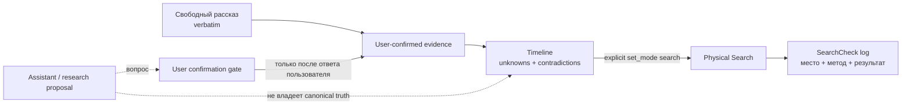
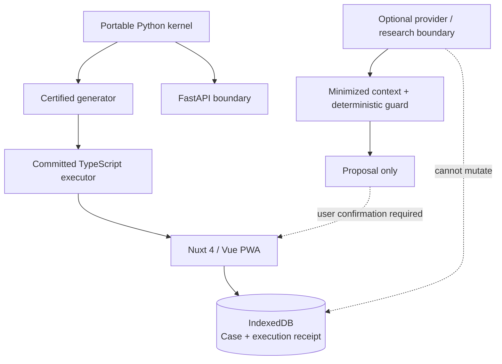

# MIND Detective / Детектив памяти

<!-- release-0.4.0 -->

<p align="center">
  
</p>

<p align="center">
  <strong>Систематический поиск потерянных вещей без угадывания и псевдовероятностей.</strong><br />
  MIND Detective разгружает рабочую память: отделяет то, что пользователь действительно сообщил и подтвердил, от вопросов и гипотез, а затем помогает последовательно пройти физические проверки.
</p>

<p align="center">
  <a href="README.md"><strong>Русский</strong></a> · <a href="README.en.md">English</a>
</p>

<p align="center">
  <a href="https://github.com/trafficolog/mind-detective/releases/tag/0.4.0"></a>
  <a href="https://github.com/trafficolog/mind-detective/actions/workflows/ci.yml"></a>
  
  
  <a href="LICENSE"></a>
</p>

> **Release 0.4.0 опубликован.** Это Web Reconstruction Foundation: deterministic Reconstruction доступен в Web/PWA локально и не требует live model для canonical memory evidence. Исследовательская линия `0.4.1` развивается отдельно и **не выпущена**.

## Что это и кому подходит

MIND Detective — помощник систематического поиска потерянных вещей. Он полезен, когда проблема не в том, чтобы «придумать ещё одно место», а в том, чтобы не потерять нить поиска: что вы точно помните, где есть пробел, что уже проверяли и каким способом.

Вместо chatbot-first интерфейса продукт держит **состояние кейса**. История диалога не является источником истины сама по себе: canonical state строится из пользовательского рассказа, подтверждённых сведений, timeline и журнала физических SearchCheck.

| MIND делает | MIND не делает |
| --- | --- |
| Сохраняет свободный рассказ дословно | Не «восстанавливает память» за пользователя |
| Отделяет подтверждённые факты от вопросов/гипотез | Не превращает правдоподобную догадку в recollection |
| Сохраняет неизвестные интервалы и противоречия | Не заполняет пробелы выдуманной хронологией |
| Ведёт журнал реальных физических проверок | Не утверждает, где предмет находится фактически |
| Помогает продолжить кейс позже | Не присваивает местам калиброванные вероятности |

## Как работает один кейс

Базовый путь выглядит так:

```text
свободный рассказ
→ подтверждённые пользователем сведения
→ timeline с неизвестными интервалами и противоречиями
→ явный переход в Search
→ физические проверки
→ SearchCheck log с методом проверки
→ pause / resume / export / close
```

Пример: вы не находите ключи и помните только «вышел из офиса, сел в машину, доехал домой». MIND сохраняет этот рассказ дословно, позволяет отдельно подтвердить известные действия и места, оставляет неизвестным то, чего вы не помните, а затем переводит кейс в Search. Проверка «осмотрел рюкзак визуально» фиксируется именно как визуальная проверка; если позже вы проверите карманы руками, это будет другой SearchCheck, а не переписывание прошлого.

### Reconstruction ≠ Search

**Reconstruction** отвечает на вопрос: *что подтверждено про последовательность событий, а что остаётся неизвестным или противоречивым?*

**Search** отвечает на вопрос: *что физически проверить дальше и что уже было действительно проверено?*

Эти режимы разделены намеренно. Вопрос помощника или research proposal не становится canonical evidence. Он может только привести к новому пользовательскому ответу, который затем проходит обычную границу подтверждения.



## Основные возможности

- **State-first Web/PWA** — главный экран показывает состояние поиска, а не заставляет восстанавливать контекст по истории чата.
- **Local-first Case persistence** — Web canonical state хранится в IndexedDB; новый Case сохраняется локально сразу.
- **Verbatim free account** — исходный рассказ сохраняется дословно как `free_account` и не классифицируется автоматически как recollection/habit/observation.
- **User-confirmed evidence** — структурированные сведения появляются только после явного пользовательского подтверждения.
- **Uncertainty-preserving timeline** — неизвестные интервалы и противоречия сохраняются, а не «исправляются» моделью.
- **Systematic physical search** — Search отделён от Reconstruction и ведёт пользователя по проверяемым действиям.
- **Method-aware SearchCheck log** — журнал хранит не только «проверено», но и способ физической проверки.
- **Offline deterministic core** — create/reconstruction/search/checklist/import path выполняется локально после preload PWA.
- **JSON portability** — Case v2 можно явно экспортировать и импортировать без облачной Case DB.
- **Research-only Reconstruction Assistant infrastructure** — R1/R2 evaluation stack существует, но пока не является production capability.

Схема Case остаётся `mind-detective-case/v2`.

## Архитектура

Python portable kernel остаётся authoritative source deterministic semantics. Web не содержит второго независимого reconstruction/search reducer: committed TypeScript executor генерируется из portable semantics и используется Nuxt/Vue PWA локально.



Для online Search assistant действует отдельная server-side proposal boundary. Исследовательская Reconstruction Assistant линия ещё строже: provider/model не получает права записывать canonical memory evidence и не владеет Case truth.

## Privacy, safety и границы знания

**Локальный canonical storage.** Web хранит Case в IndexedDB. Plugin surface сохраняет `.mind-detective/cases/<case-id>/case.json` только по явному persistence action. Explicit JSON export/import остаётся переносимым форматом.

**Что может покинуть устройство.** Deterministic Reconstruction provider не вызывает. Для online/research boundary наружу может передаваться только разрешённый минимизированный transient context; raw full account, весь Case и unrelated Search state не становятся provider payload «по умолчанию».

**Эпистемическая граница.** MIND не выдаёт confidence score за вероятность фактической локации, не диагностирует механизм забывания и не превращает assistant proposal в память пользователя.

**High-consequence uncertainty.** Неопределённость по потенциально опасным забытым действиям выводится из обычного search reasoning через отдельный `limit_and_escalate` путь.

**Provider/model ≠ canonical truth.** Даже валидный research proposal остаётся вопросом/предложением до пользовательского подтверждения.

Подробнее: [Privacy](docs/PRIVACY.md), [Methodology](docs/METHODOLOGY.md), [Architecture](docs/ARCHITECTURE.md).

## Статус проекта

| Слой | Статус |
| --- | --- |
| `0.4.0` Web Reconstruction Foundation | **Опубликован**: repository release `0.4.0` и plugin release `mind-detective-v0.4.0` |
| Deterministic Web Reconstruction | **Production foundation**: free account, confirmed evidence, uncertainty-preserving timeline, explicit Search transition |
| Phase 4 — R2 proposal guard | **Merged**: deterministic fail-closed guard для research proposals |
| Phase 5 — minimized provider context | **Merged**: отдельный минимизированный provider-visible context contract |
| Phase 6 — offline screening harness | **Merged**: fixed-corpus replay/screening infrastructure, не provider benchmark |
| Provider privacy governance | **Merged**: общий privacy-review contract и provider-specific reviewed profiles |
| Execution preflight | **Merged**: account/project/model/config readiness contract перед любым будущим real run |
| Реальный provider/model screening | **Не выполнялся** |
| Gate A | **Gate A не пройден** |
| Human pilot | **Human pilot не запускался** |
| Production Reconstruction Assistant | **Production Reconstruction Assistant не активирован** |
| `0.4.1` | Research line, **не выпущена** |

Текущие provider-specific privacy profiles (OpenAI API EU ZDR, Anthropic API ZDR, Google Vertex AI EU ZDR) — это **configuration-level eligibility для synthetic fixed-corpus research**, а не рейтинг, рекомендация или доказательство качества модели. `execution preflight` также не является разрешением на API-вызов.

Исследовательская последовательность остаётся такой:

```text
privacy contract
→ provider-specific reviewed profile
→ execution preflight
→ отдельная human authorization на exact provider/model run
→ fixed-corpus screening
→ Gate A
→ только затем возможное решение о human pilot
```

## Быстрый старт

### 1. Установить зависимости

```bash
python -m pip install -e apps/api
pnpm install --frozen-lockfile
```

### 2. Запустить API

```bash
uvicorn mind_detective_api.app:app --app-dir apps/api --host 127.0.0.1 --port 8000 --reload
```

### 3. Запустить Web/PWA

```bash
pnpm --dir apps/web dev --host 127.0.0.1 --port 3000
```

Откройте `http://127.0.0.1:3000`. Deterministic Reconstruction работает без provider credentials; optional online assistant boundary настраивается отдельно.

### Минимальная проверка репозитория

```bash
python scripts/validate_repo.py
python -m unittest discover -s tests -v
python -m unittest discover -s plugins/mind-detective/tests -v
PYTHONPATH=plugins/mind-detective:apps/api python -m unittest discover -s apps/api/tests -v
pnpm --dir apps/web exec vitest run
pnpm --dir apps/web build
pnpm --dir apps/web exec playwright test
```

Полный setup, environment variables, offline proof и developer checks: [Getting Started](docs/GETTING_STARTED.md).

## Как пройти кейс в Web/PWA

1. Создайте новый Case и оставайтесь в Reconstruction.
2. Введите свободный рассказ — он сохранится дословно.
3. Добавьте только те structured statements, которые готовы подтвердить.
4. Перестройте timeline; неизвестные интервалы и противоречия останутся явными.
5. Перейдите в Search только через явное действие.
6. Фиксируйте реальные проверки в SearchCheck log с методом проверки.
7. При необходимости поставьте кейс на паузу, продолжите позже или сделайте JSON export/import.

MIND не обещает, что предмет будет найден. Ценность продукта — в воспроизводимом процессе поиска и сохранении того, что действительно известно и проверено.

## Структура репозитория

```text
apps/
  api/                  FastAPI boundary
  web/                  Nuxt 4 / Vue PWA
plugins/
  mind-detective/       portable domain/plugin surface
scripts/                validation, generation, R1/R2 research utilities
conformance/            local-execution parity corpus
docs/
  evaluation/           product/reconstruction research contracts
  adr/                  architecture decisions
  superpowers/          approved specs and implementation plans
tests/                  repository-level contracts and research checks
.github/                CI and release publication surfaces
```

## Документация

| Раздел | RU | EN |
| --- | --- | --- |
| Getting Started | [docs/GETTING_STARTED.md](docs/GETTING_STARTED.md) | [docs/GETTING_STARTED.en.md](docs/GETTING_STARTED.en.md) |
| Architecture | [docs/ARCHITECTURE.md](docs/ARCHITECTURE.md) | [docs/ARCHITECTURE.en.md](docs/ARCHITECTURE.en.md) |
| Methodology | [docs/METHODOLOGY.md](docs/METHODOLOGY.md) | [docs/METHODOLOGY.en.md](docs/METHODOLOGY.en.md) |
| Privacy | [docs/PRIVACY.md](docs/PRIVACY.md) | — |
| Product Evaluation | [docs/PRODUCT_EVALUATION.md](docs/PRODUCT_EVALUATION.md) | — |
| Contract Matrix | [docs/CONTRACT_MATRIX.json](docs/CONTRACT_MATRIX.json) | machine-readable |
| Reconstruction research protocol | [RECONSTRUCTION_PROTOCOL_V1.md](docs/evaluation/RECONSTRUCTION_PROTOCOL_V1.md) | shared |
| Scenario corpus | [RECONSTRUCTION_SCENARIO_CORPUS_V1.md](docs/evaluation/RECONSTRUCTION_SCENARIO_CORPUS_V1.md) | shared |
| R2 proposal guard | [R2_PROPOSAL_GUARD_V1.md](docs/evaluation/R2_PROPOSAL_GUARD_V1.md) | shared |
| R2 provider context | [R2_PROVIDER_CONTEXT_V1.md](docs/evaluation/R2_PROVIDER_CONTEXT_V1.md) | shared |
| R2 offline screening | [R2_OFFLINE_SCREENING_V1.md](docs/evaluation/R2_OFFLINE_SCREENING_V1.md) | shared |
| Provider privacy review | [R2_PROVIDER_PRIVACY_REVIEW_V1.md](docs/evaluation/R2_PROVIDER_PRIVACY_REVIEW_V1.md) | shared |
| Provider-specific reviews | [R2_PROVIDER_SPECIFIC_PRIVACY_REVIEWS_2026-09-13.md](docs/evaluation/R2_PROVIDER_SPECIFIC_PRIVACY_REVIEWS_2026-09-13.md) | shared |
| Execution preflight | [R2_EXECUTION_PREFLIGHT_V1.md](docs/evaluation/R2_EXECUTION_PREFLIGHT_V1.md) | shared |
| Release Policy | [docs/RELEASE_POLICY.md](docs/RELEASE_POLICY.md) | [docs/RELEASE_POLICY.en.md](docs/RELEASE_POLICY.en.md) |
| Changelog | [CHANGELOG.md](CHANGELOG.md) | [CHANGELOG.en.md](CHANGELOG.en.md) |

Architecture decision для Web Reconstruction: [ADR 015 — Web reconstruction portable boundary](docs/adr/015-web-reconstruction-portable-boundary.md).

## Ограничения

- нет доказанного provider/model winner;
- нет пройденного Gate A для R2;
- нет human pilot данных для Reconstruction Assistant;
- нет production activation live-model Reconstruction Assistant;
- нет Bayesian/POD location model или calibrated location probabilities;
- нет cloud Case database, background Case sync или cross-case learning;
- `0.4.1` research work в `main` не означает релиз `0.4.1`.

Нормативные детали остаются в authoritative docs и executable contracts; README специально служит человекочитаемой картой продукта, а не заменой этих контрактов.
